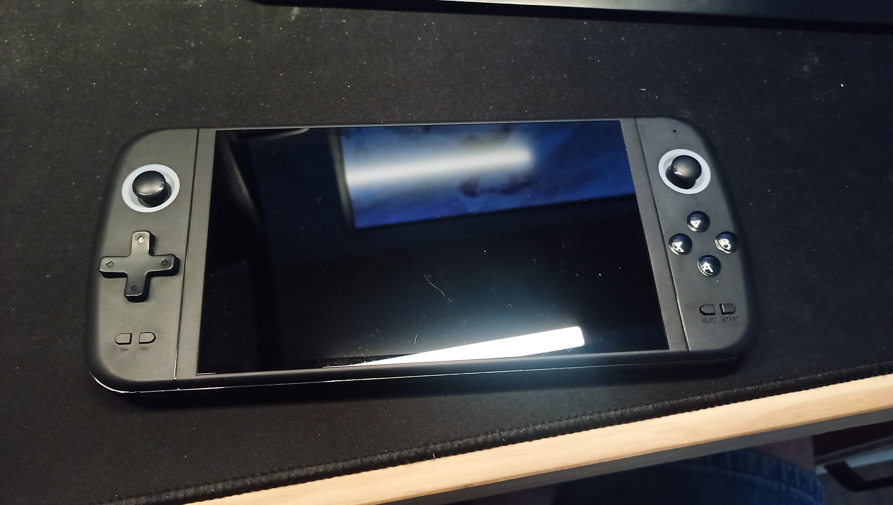

<p align="center">
  
</p>

# Sjgam-M27-unlock
Community-driven reverse engineering project for the SJGam M27 handheld console. Exploring the hidden Android 4.4 system and its RK3188 chipset (yes, really...), firmware internals, hardware interfaces, and custom software possibilities.

# OpenM27

The SJGam M27 is a 7 inch emulation handheld built on top of a heavily stripped-down Android 4.4 system running on Rockchip hardware Rk3188.

This project aims to document the hardware and software architecture of the console and explore possibilities such as:

- Accessing the hidden Android environment
- Launcher replacement
- ADB restoration
- Custom firmware development
- Hardware documentation
- Alternative operating systems

## Current Status

### factory Check access
- press select and (A,B,X,Y) in the original template launch testmode.apk

### Hardware access
- Loader mode accessible using `VOL-` during boot.
- Full NAND backup successfully dumped using Rockchip tools.
- Console remains recoverable even after corrupted firmware flashes.

### Firmware analysis
- Complete partition dump obtained:
  - `boot.bin`
  - `kernel.bin`
  - `system.bin`
  - `userdata.bin`
  - `recovery.bin`
  - ...

### Android discovery
- Hidden Android 4.4.2 environment confirmed.
- `GameTemplate.apk` identified as the main launcher/frontend.
- Removing `GameTemplate.apk` boots directly into Android.

### Custom software
- Custom APK installation through `system.bin` modifications works.
- `ATV Launcher` works correctly.
- `Total Commander` works correctly.
- Third-party applications can be installed and launched.

### Reverse engineering
- `testmode_r10.apk` analyzed.
- Hardware GPIO access discovered:
  - `gpio169`
  - `gpio264`
- Hardware diagnostics application identified.

### USB investigation
- `adb` binary found in `/system/bin`.
- `adbd` daemon found in `/sbin/adbd` inside boot ramdisk.
- Boot configuration already contains:
  - `ro.debuggable=1`
  - `persist.sys.usb.config=adb`
- ADB still not visible over USB.
- Current hypothesis: missing Android USB gadget driver or disabled USB gadget subsystem.

### Alternative firmware experiments
- RK3188 Android images partially boot on the device.
- Generic ARM SD card boot attempts unsuccessful.
- Device appears to boot exclusively from internal NAND/eMMC.

### Current objectives
- Restore ADB access.
- Enable a TV-compatible virtual keyboard.
- Obtain local shell access.
- Investigate possibility of rebuilding a more complete Android environment.


# 🎮 SJGam M27 Unlock Project update 14/07/2026

> Community driven reverse engineering effort focused on understanding,
> documenting and unlocking the SJGam M27 handheld console.

------------------------------------------------------------------------

## 🚀 Major milestone reached

A generic RK3188 recovery image (kingston tablet)was successfully booted on the SJGam
M27, providing for the first time:

-   ✅ USB ADB access
-   ✅ Root shell access
-   ✅ Direct access to internal partitions
-   ✅ Live inspection of hardware devices

This marks the transition from offline firmware analysis to live system
exploration.

------------------------------------------------------------------------

## 🔍 Hardware findings

  Component          Status
  ------------------ ----------------------------
  CPU family         RK30 / RK3188 compatible
  Kernel             Linux 3.0.36+
  Android version    4.4.2 KitKat
  Board identifier   RK30board
  Bootloader         Rockchip legacy boot chain

------------------------------------------------------------------------

## 🔌 USB and ADB

The recovery kernel exposes:

``` text
/sys/class/android_usb/android0
functions = adb
state = CONFIGURED
```

ADB over USB works correctly.

### Current hypothesis

The original SJGam firmware probably disables or omits:

-   USB Gadget support
-   Android USB framework
-   ADB USB support

This appears to be a software limitation rather than a hardware one.

------------------------------------------------------------------------

## 🎮 Input devices discovered

``` text
rk29-keypad
gslX680 touchscreen controller
Twin USB JoysticK
```

The integrated controls are exposed as an internal USB joystick:

  Vendor ID   Product ID
  ----------- ------------
  0810        0001

This discovery may explain the unusual behaviour encountered while
editing Android keylayout files.

------------------------------------------------------------------------

## GPIO status

The recovery kernel exposes the following GPIO controllers:

| GPIO controller | Status |
|-----------------|--------|
| gpiochip160 | Present |
| gpiochip192 | Present |
| gpiochip224 | Present |
| gpiochip256 | Present |

Current mapping remains unknown and is under investigation.

Potential targets include:

- RGB left and right
- Display backlight

------------------------------------------------------------------------

## 🧩 Partition layout

``` text
parameter
misc
kernel
boot
recovery
backup
cache
userdata
metadata
kpanic
system
user
```

------------------------------------------------------------------------

## 📜 Parameter partition

The `parameter` partition reveals:

``` text
FIRMWARE_VER:4.4.2
MACHINE_MODEL:rk3188
MANUFACTURER:RK30SDK
MACHINE:3066
```

Multiple copies of the partition table are stored for redundancy.

------------------------------------------------------------------------

## 📌 Next objectives

-   Extract original boot chain components.
-   Compare stock and recovery kernels.
-   Restore permanent ADB access.
-   Investigate bootloader replacement possibilities.
-   Document gamepad mapping and GPIO usage.
-   Explore alternative operating systems and custom firmware.

------------------------------------------------------------------------

## ⚠️ Disclaimer

All experiments are performed at your own risk.

Always keep complete backups of original firmware images before flashing
modified components.

------------------------------------------------------------------------

*The SJGam M27 is proving to be much closer to a generic RK3188 tablet
than initially expected.*
